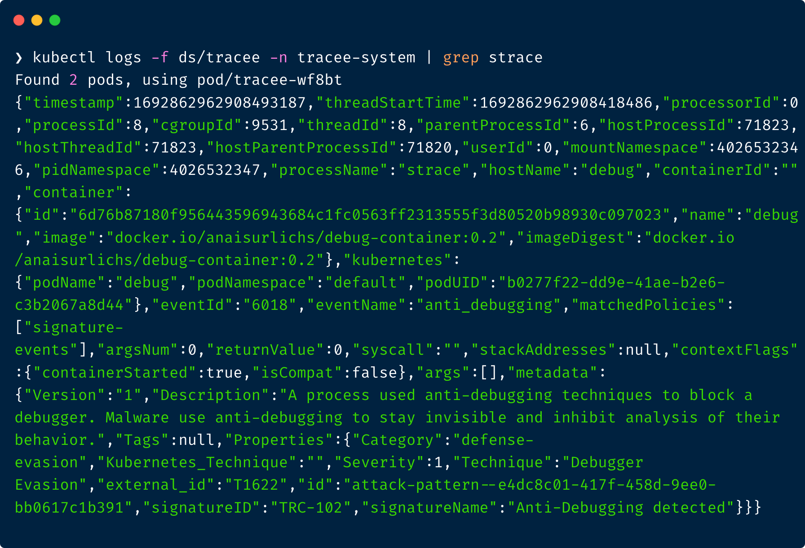

# Tracker: Runtime Security and Forensics using eBPF

Tracker uses eBPF technology to tap into your system and give you access to hundreds of events that help you understand how your system behaves.
In addition to basic observability events about system activity, Tracker adds a collection of sophisticated security events that expose more advanced behavioral patterns. 
Tracker provides a rich filtering mechanism that allows you to eliminate noise and focus on specific workloads that matter most to you.

**Key Features:**
* Kubernetes native installation
* Hundreds of default events
* Ships with a basic set of behavioral signatures for malware detection out of the box 
* Easy configuration through Tracker Policies 
* Kubernetes native user experience that is targetted at cluster administrators

> We release new features and changes on a regular basis. Learn more about the letest release in our [discussions.](https://github.com/khulnasoft-lab/tracker/discussions)

To learn more about Tracker, check out the [documentation](https://khulnasoft-lab.github.io/tracker/latest/docs/overview/). 

## Quickstart

Installation options:
* [Install Tracker in your Kubernetes cluster.](https://khulnasoft-lab.github.io/tracker/latest/getting-started/kubernetes-quickstart)
* [Experiment using the Tracker container image.](https://khulnasoft-lab.github.io/tracker/latest/getting-started/docker-quickstart)

Steps to get started:
1. [Install Tracker in your Kubernetes cluster through Helm](https://khulnasoft-lab.github.io/tracker/latest/getting-started/kubernetes-quickstart/)
2. Query logs to see detected events

Next, try one of our tutorials:
3. Filter events through [Tracker Policies](https://khulnasoft-lab.github.io/tracker/latest/tutorials/k8s-policies/) 
4. [Manage logs through Grafana Loki](https://khulnasoft-lab.github.io/tracker/latest/tutorials/promtail/) or your preferred monitoring solution

Example log output in Tracker pod
## Contributing
  
Join the community, and talk to us about any matter in the [GitHub Discussions](https://github.com/khulnasoft-lab/tracker/discussions) or [Slack](https://slack.khulnasoft.com).  
If you run into any trouble using Tracker or you would like to give use user feedback, please [create an issue.](https://github.com/khulnasoft-lab/tracker/issues)

Find more information on [contributing to the source code](https://khulnasoft-lab.github.io/tracker/latest/contributing/overview/) in the documentation.

Please consider giving us a star ⭐️
by clicking the button at the top of the [GitHub page](https://github.com/khulnasoft-lab/tracker/)

## More about Khulnasoft Security

Tracker is an [Khulnasoft Security](https://khulnasoft.com) open source project.  
Learn about our open source work and portfolio [here](https://www.khulnasoft.com/products/open-source-projects/).
